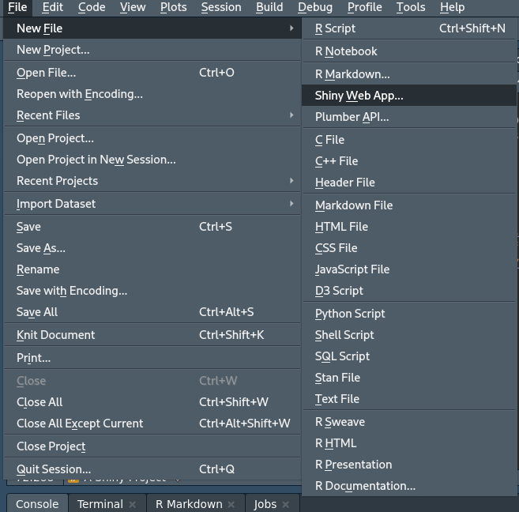

```{r setup, include=FALSE}
knitr::opts_chunk$set(echo = TRUE)
```

# Intro  


## Github Link for Lectures  
**[Developing Data Products' lectures on GitHub](https://github.com/DataScienceSpecialization/Developing_Data_Products)**  

## Course Book  
**[The book for this course is available on leanpub](https://leanpub.com/ddp)** 

## Instructor's Note  
"*This course is about building tools for improving the data analysis process, making data driven decisions, or for other infrastructure that supports other data products...*  
*To preview some of the topics we'll be covering. With the R Markdown package you can create websites, PDFs, presentations, and even e-books from a single file in R in a way that you're very comfortable and familiar with. We'll teach the latest features of the Shiny package which you can use to create interactive web applications in R. We'll talk about interactive graphics using Plotly and Leaflet which allows you to create beautiful maps that you can share online. We'll do similar things with the package GoogleViz which allows you to create maps and interactive graphics and tables. We've also added how to use swirl and swirlify to design courses in R so that you can share your knowledge...*  
  
*- Brian Caffo and the Data Science Track Team*"


# Shiny, GoogleVis, and Plotly  
## Shiny Part 1  

### Shiny Overview (1.1)  
#### What is Shiny?  
* Shiny is a web development framework in R, meaning one only needs to know R to use it.  
  + Helps one get around a possible lack of resources or knowledge in JavaScipt, HTML, etc.  

* Shiny needs a server to run on  
  + One can use their own, RStudio's limited free hosting service, or something like Amazon AWS. RStudio also has a paid version of their service.  
* Shiny application vs. Shiny server  
  + Apps a ran locally and use RStudio's service for hosting the app on their servers, on a platform called shinyapps.io  
    - the free version only allows one to run 5 apps for a certain amount of time per month  
    - RStudio will send one a message if the limit is reached  
    - Should one hit the 25-hour per month limit they can send an email to *shinyapps-support@rstudio.com* to request an increase in their limit so one can continue working on thier project (for this course)  
  + A Shiny server is required such that one can host a shiny app for the world  
    - It requires understanding a little linux server administration and won't be covered in this course.  

* Although everything is done in R it is helpful to have some knowledge of HTML to know what the commands in R are actually doing.  
* Shiny uses `Bootstrap` (no relation to the statistical method) style, which suffices for aesthetics, rendering, and resizing to fit different screens.    

#### HTML, CSS, and Javascript Tutorials  
* **[Mozilla Developer Network Tutorials](https://developer.mozilla.org/en-US/docs/Web/Tutorials)**  
* **[HTML & CSS from Khan Academy](https://www.khanacademy.org/computing/computer-programming/html-css)**  
* **[Tutorials from Free Code Camp](https://www.freecodecamp.com/)**

#### A Shiny Project  
* There is **[a tutorial for shiny on RStudio](https://shiny.rstudio.com/tutorial/)**, however these notes will sort of walk through that tutorial anyway.  
* A computer interfaces with the app to generate new plots/results based on the users' input on the app.  
* A shiny project consists of a directory with at least two files:  
  + `ui.R` (for user interface) controls how your app looks.  
  + `server.R` that controls what your app does, held on the server.  
  + NOTE: The app doesn't actually need these two files but rather the functions the contain, as such it's also an option to just have a `app.R` file.  
* **[RStudio has some examples of shiny apps too](https://shiny.rstudio.com/gallery/#user-showcase)**  

* I also found someone **[made a game using Shiny](https://towardsdatascience.com/is-r-shiny-versatile-enough-to-build-a-video-game-5c93232ef4e2)**. The game's app also contains **[a link to the GitHub repo.](https://github.com/pedrocoutinhosilva/shiny.decisions/tree/master/src/app)**  


### Shiny Code Demos (1.2)  
A demo is located in `./helloShiny`  

#### Set-Up  

  
  
  
  
  

#### ui.R  
* requires the function `shinyUI`  
  + `fluidPage(` by default has a main panel, `mainPanel(` and a sidebar panel, `sidebarLayout(sidebarPanel(`  

#### server.R  
* requires the function `shinyServer`  
  + Any logical computations are done here


### Shiny HTML Tags (1.3)  
* Shiny provides several wrapper functions for using standard HTML tags in your `ui.R`, including:  
  + `h1()` through `h6()` for headlines  
  + `p()` for paragraphs  
  + `br()` for line-breaks  
  + `a()` for inserting hyperlinks  
  + `div()` denotes a section styled with CSS  
  + `span()` to color a part of the text  
  + See the help page, `?builder` for more details.  
  + A guide of HTML tags **[can be found on this site](https://www.w3schools.com/tags/)**  
  
* Some of these tags are tested in `./helloShiny/`  

### Shiny Apps with I/O (1.4)  
* In this first demo we'll be looking at a slider input, which will just show the value to the user. This demo is found in `./helloSlider/`  


### Shiny Apps with Plots (1.5)
* Allowing users to manipulate data nd see the reults of their manipulations as a plot can be very useful  
* Shiny provides the `plotOutput()` function for `ui.R`  
* ...and the `renderPlot()` function for `sever.R`  
* The demo of this is in `./helloPlot/`  
* Also contains: 
  + in/de-crementing arrows for a textbox  
  + checkboxes for a logical if labels are present  
  

## Shiny Part 2  

### Reactivity (2.1)  
* A reactive expression manipulates inputs from Shiny and returns a value.  
* Reactivity provides a way for your app to respond, as inputs will change depending on how users interact with your UI  
* Expressions that are subject to change should be wrapped with the function `reactive()`  
  + Because of the syntax of Shiny this may look a bit "unorthodox" for R code (Having `({...})`)  
* Creating a reactive expression is like creating a function:  
```{r eval = FALSE}
calc_sum <- reactive({
  input$box1 + input$box2
})

# ...

calc_sum()
```

* Later we'll look at having the user push a button to have the app react, which is helpful for more computational heavy computations.  

### `reactive` Example (2.2)  
* An example that uses the `reactive` function can be found in `./helloReactive/`  


### Delayed Reactivity (2.3)  
* One may not want an app to immediately react to changes in user input, such as in cases of long-running calculation
* In order to prevent reactive expressions from reacting one can include a submit button in the app.  
* An example of this can be found in `./helloSubmit/`, which is a "fork" of `./helloReactive/` but with the submit button (only comments about the submit button are present in this document).    

### Tabs (2.4)  
* There are several other kinds of UI components that one can add to an app, such as tabs  
  + tabs - gives app multiple views  
  + navbars - to click around multiple tabs, like a top menu  
  + sidebars - just like navbars but on the side  
  
* There are functions for managing these tabs:  
  + `tabsetPanel()` - specifies a group of tabs  
  + `tabPanel()` - specifies the contents of an individual tab  

* An example of tabs can be found in `./helloTabs/`    

### Using your own HTML (2.5)  
* To use custom HTML one would save the code as `index.html` in a directory, named `www`, which is a child of the directory containing the `server.R` file  
* Most of the style from Shiny's bootstrap setup in the header will no longer be needed

### Interactive Graphics (2.6)  
* A feature of Shiny is the ability to create graphics that a user can interact with.  
* One method that can be used to select multiple data points on a graph is by specifying the `brush` parameter in `plotOutput()` in the `ui.R` file, then using the `brushedPoints()` function in the `server.R` file.  
* The `./helloBrush/` directory gives an example that draws a line of best fit, given user selected points.  


## Shiny Gadgets  

### Overview (1.1)  
* Shiny Gadgets provide a way to use Shiny's interactivity and UI as a part of a data analysis.  
* A function is created that opens a small Shiny app in the RStudio viewer pane
  + Since it's smaller we use the `miniUI` package for manipulating the GUI  
  + A gadget is a singular function that contains it's own  `ui` and `server` functions.  
* An example of a gadget to use can be found in `myFirstGadget.R` (were you expecting `helloGadget`?), the function's code is displayed below.  
```{r}
library(shiny)
library(miniUI)

myFirstGadget <- function() {
    ui <- miniPage(
        gadgetTitleBar("My First Gadget")
    )
    server <- function(input, output, session) {
        # Put in a Done button to close the app
        observeEvent(input$done, {
            stopApp()
        })
    }
    runGadget(ui,server)
}
```


### Shiny Gadgets (1.2)  
* An advantage of Shiny Gadgets is that since theya re functions they can take values as arguments and then return values.  
* We'll create a simple example of a Gadget that has I/O  
  + It will take two different vectors of numbers as arguments & use them to populate two `selectInput`s. The user can then choose two numbers within the Gadget and their product will be returned  
  + (Note: I won't be creating a separate file for this one)
```{r}
library(shiny)
library(miniUI)

multiplyNumbers <- function(numbers1, numbers2) {
  ui <- miniPage(
    gadgetTitleBar("Multiply Two Numbers"),
    miniContentPanel(
      #Make two drop-down boxes of selection options
      selectInput("num1", "First Number", choices = numbers1),
      selectInput("num2", "Second Number", choices = numbers2)
    )
  )
  
  server <- function(input, output, session) {
    observeEvent(input$done, {
                 num1 <- as.numeric(input$num1)
                 num2 <- as.numeric(input$num2)
                 stopApp(num1 * num2)
                 })
  }
  runGadget(ui, server)
}
```


### Gadgets with Interactive Graphics (1.3)  
* Gadgets can be used to create interactive plots, which can be helpful during the exploratory process or presentation of data.  
* Below we'll be looking at an example of this.  
```{r}
library(shiny)
library(miniUI)

pickTrees <- function() {
  #User Interface
  ui <- miniPage(
    #Title
    gadgetTitleBar("Select Points by Dragging your Mouse"),
    #Show plot with brush interaction
    miniContentPanel(
      plotOutput("plot", #Plot is named "plot"
                 height = "100%", brush = "brush") #Brush is named "brush"
    )
  )
  
  #Logic
  server <- function(input, output, session) {
    #Display plot
    output$plot <- renderPlot({
      plot(trees$Girth, trees$Volume, main = "Trees!",
           xlab = "Girth", ylab = "Volume")
    })
    
    #On Done button, get selected points & print df of selection to console
    observeEvent(input$done, {
      stopApp(brushedPoints(trees, input$brush,
                            xvar = "Girth", yvar = "Volume"))
    })
  }
  
  runGadget(ui, server)
}
```

* The original data frame row numbers are retained, as such this can be helpful to quickly identify outliers in one's data


## GoogleVis  
### GoogleVis (1.1)  
* `googleVis` is a package that connects R to Google's visualization API  
* Allows one to create visuals that would otherwise be difficult to create without it.  
* googleVis charts can be embedded into the HTML when using Knitter too  
* Btw googleVis uses flash, so unless they change something this will be obsolete after browsers stop supporting flash entirely.  
  + Maybe check out the suggested packages in the answer to **[this StackOverflow question.](https://stackoverflow.com/questions/17786043/alternative-for-googlevis-in-r)**  

#### Motion Chart Example  
```{r message = FALSE}
library(googleVis)
M <- gvisMotionChart(Fruits, #Example data included with GVis
                     idvar = "Fruit", timevar = "Year")

#To view the chart in a web browser with flash from Command line use
# plot(M)
# print(M, "chart") #prints HTML to run flash
```


### Charts in googleVis (1.2)  
* Motion charts: `gvisMotionChart`  
* Interactive maps: `gvisGeoChart`  
* Interactive tables: `gvisTable`  
* Line charts: `gvisLineChart`  
* Bar charts: `gvisColumnChart`  
* Tree maps: `gvisTreeMap`  
* **[The full documentation can be fround on CRAN](http://cran.r-project.org/web/packages/googleVis/googleVis.pdf)**  

#### Plots on Maps Example  
```{r}
G <- gvisGeoChart(Exports, 
                  locationvar = "Country", colorvar = "Profit")
# plot(G) #Commented out because... flash
```
* **[Options that can be used with googleVis can be found here](https://developers.google.com/chart/interactive/docs/gallery/geochart)** (**[Archived here, just in case](https://web.archive.org/web/20200416200251if_/https://developers.google.com/chart/interactive/docs/gallery/geochart)**)  

#### Combing Multiple Plots Together  
```{r}
G <- gvisGeoChart(Exports, "Country", "Profit")
T1 <- gvisTable(Exports)
M <- gvisMotionChart(Fruits, "Fruit", "Year")
GT <- gvisMerge(G, T1, horizontal = FALSE) #Vertical combo (like cbind)
GTM <- gvisMerge(GT, M, horizontal = TRUE, #Horizontal combo
                 tableOptions = "bgcolor=\"#CCCCCC\" cellspacing=10")
#plot(GTM)
```

#### Viewing the HTML code  
```{r eval = FALSE, echo = TRUE}
M <- gvisMotionChart(Fruits, "Fruit", "Year")

#View locally (setting results = "asis" in Rmd would 
# make the HTML code paste right in)
print(M)

# Save HTML to a file  
print(M, 'chart', file = "myfilename.html")
```

#### Things You Can do with Google Vis  
* The visualizations can be embedded in websites with HTML code  
* Dynamic visualizations can be built with `Shiny`, `Rook`, and `R.rsp`  
* Embed them in R markdown based documents  
  + Set `results="asis"` in the chunk options  
  * Can be used with `kniter` and `slidify`  
  + Sometimes clearing `kniter` cache can help the (static) charts display  
  
#### For More Info  
* `demo(googleVis)` will show off some plots... using flash when needed  
* **[CRAN vignette](http://cran.r-project.org/web/packages/googleVis/vignettes/googleVis.pdf)**  
* **[CRAN package info](http://cran.r-project.org/web/packages/googleVis/googleVis.pdf)**  
* **[Google's documentation](https://developers.google.com/chart/interactive/docs/gallery)**  
* **[Google's FAQ](https://developers.google.com/chart/interactive/faq)**  

## Plotly  
### Plotly Intro (1.1)  
* `Plotly` is helpful for creating interactive web graphics with R  
* Can integrate with a lot of other languages too, such as: R, Python, MatLab, JavaScript, and Microsoft Excel.   
* To share visualizations online one will need an account on **[the plotly site](https://plotly.com/)**  
* However the `plotly` package will let one just make HTML graphics independent of the plotly site
* Outputs from `knitr` that warrant for interaction will allow interaction with `plotly` plots 


### Basic Scatter Plot (1.2)  
* A scatter plot is indicated with the parameter `mode = "markers"`  
```{r message = FALSE}
library(plotly)
plot_ly(data = mtcars, x = ~wt, y = ~mpg, # '~' is needed to refer to vars
        mode = "markers") # Designates a scatter plot
```


### Adding Qualatative Variables (1.3)  
#### Discreet Color  
```{r message=FALSE}
plot_ly(mtcars, x = ~wt, y = ~mpg, mode = "markers",
        color = ~as.factor(cyl))#Color by cylinder type
```

#### Continuous Color  
```{r message=FALSE}
plot_ly(mtcars, x = ~wt, y = ~mpg, mode = "markers",
        color = ~disp)#Color by displacement, a continuous varaible
```
  
#### Altering Size  
```{r message=FALSE}
plot_ly(mtcars, x = ~wt, y = ~mpg, mode = "markers",
        color = ~as.factor(cyl), size = ~hp)
```

#### 3D Scatter Plot  
* A three-dimensional scatterplot can be created with the `type = "scatter3d"` argument.  
  + These plots can be clicked and dragged to view different angles  
* Uses WebGL to create interactive 3D graphics in a web page
```{r message = FALSE}
set.seed(1618033)
temp <- rnorm(100, mean = 30, sd = 5)
pressure <- rnorm(100)
dtime <- 1:100

plot_ly(x = temp, y = pressure, z = dtime,
        type = "scatter3d", #For 3D plot
        mode = "markers", #Plot type still needs to be denoted
        color = temp) #Qualities can still be applied
```


### Line Graphs (1.4)  
#### Standard Line Graph Example  
* Default for `plot_ly` is to make a scatter plot, so the argument `mode = "line"` has to be passed.  
```{r message = FALSE}
data("airmiles")
head(cbind(time(airmiles), airmiles))
plot_ly(x = time(airmiles), y = airmiles, mode = "line")
```

#### Multi Line Graph - Stock Example  
* Multiple lines can be shown by specifying the column in the data frame that separates the lines  
```{r message = FALSE}
library(plotly)
library(tidyr)
library(dplyr)
library(reshape2)
data("EuStockMarkets")

stocks <- as.data.frame(EuStockMarkets) %>%
  melt(value.name = "price") %>%
  mutate(index = variable,
         time = rep(time(EuStockMarkets), 4))
head(stocks)
plot_ly(stocks, x = ~time, y = ~price, color = ~index, mode = "line")
```


### Other Plots (1.5)  
#### Histogram  
* Use the `type = "histogram"` argument  
```{r message = FALSE}
plot_ly(x = ~precip, type = "histogram")
```

#### Boxplot  
* Use the `type = "box"` argument  
```{r message = FALSE}
plot_ly(iris, y = ~Petal.Length, color = ~Species, type = "box")
```

#### Heatmap  
* Use the `type = "heatmap"` argument  
```{r}
set.seed(1618033)
terrain1 <- matrix(rnorm(100*100), nrow = 100, ncol = 100)
plot_ly(z = terrain1, type = "heatmap")
```

#### 3D Surface  
* Create move-able 3D surfaces with `type = "surface"`  
```{r message = FALSE}
set.seed(1618)
terrain2 <- matrix(sort(rnorm(100*100)), nrow = 100, ncol = 100)
plot_ly(z = terrain2, type = "surface")
```


### Choropleth Maps (1.6)  
* Geographical maps with regions colored by a variable  
```{r message = FALSE}
# Create data frame
state_pop <- data.frame(State = state.abb, Pop = as.vector(state.x77[,1]))
#Create hover text
state_pop$hover <- with(state_pop, paste(State, "<br>", "Population:", Pop))
head(state_pop)

#Make state borders red
borders <- list(color = toRGB("#FF0000"))

#Set up some mapping options  
map_options <- list(
  scope = "USA",
  projection = list(type = "albers usa"),
  showlakes = TRUE,
  lakecolor = toRGB("#FFFFFF")
)

#Create plot 
plot_ly(state_pop, z = ~Pop, text = ~hover, #text displayed when hovered over
        locations = ~State,
        type = "choropleth",
        locationmode = "USA-states",
        color = ~Pop, colors = "Blues", marker = list(line = borders)) %>%
  layout(title = "US Population in 1975", geo = map_options)
```


### Displaying ggplots with Plotly (1.7)  
```{r message = FALSE}
set.seed(100)
d <- diamonds[sample(nrow(diamonds), 1000), ]
p <- ggplot(data = d, aes(x = carat, y = price)) +
  geom_point(aes(text = paste("Clarity:", clarity)), size = 4) +
  geom_smooth(aes(colour = cut, fill = cut)) + facet_wrap(~ cut)

(gg <- ggplotly(p))
```


### Posting to Plotly (1.8)  
* With a saved plotly plot, `gg` in this case, one wants to execute `plotly_POST(gg)`, however you have to have an authentication API established:
```{r eval = FALSE, echo = TRUE}
Sys.setenv("plotly_username" = "your_plotly_username")
Sys.setenv("plotly_api_key" = "your_api_key")
```
  + One can save these commands in their `.Rprofile` file to run everytime R is started  

* Extra note: For kniting PDFs one can see **[this StackOverflow post for instructions](https://stackoverflow.com/questions/40268152/plotly-as-png-in-knitr-rmarkdown)**  

**Reminder to Commit (05), Delete this line** ***AFTER*** **Committing**  

## Quiz 1  
1. Which of the following are absolutely necessary for creating a functioning shiny app?  
* A ui.R file containing a call to shinyUI()  
* A server.R file containing a call to shinyServer()


2. What is incorrect about the following syntax in ui.R? 
```{r eval = FALSE, echo = TRUE}
library(shiny)
shinyUI(pageWithSidebar(  
  headerPanel("Data science FTW!"),  
  sidebarPanel(    
     h2('Big text')    
     h3('Sidebar')  
  ),  
  mainPanel(      
       h3('Main Panel text')  
  )
))
```

* Missing a comma in the sidebar panel  

3. Consider the following in ui.R  
```{r eval = FALSE, echo = TRUE}
shinyUI(pageWithSidebar(  
   headerPanel("Example plot"),  
   sidebarPanel(    
     sliderInput('mu', 'Guess at the mu',value = 70, 
                 min = 60, max = 80, step = 0.05,)
     ), 
   mainPanel(    
     plotOutput('newHist')  
   )
))
```

And the following in server.R
```{r eval = FALSE, echo = TRUE}
library(UsingR)
data(galton)

shinyServer(  
    function(input, output) {    
       output$myHist <- renderPlot({      
          hist(galton$child, xlab='child height',
               col='lightblue',main='Histogram')      
          mu <- input$mu      
          lines(c(mu, mu), c(0, 200),col="red",lwd=5)      
          mse <- mean((galton$child - mu)^2)      
          text(63, 150, paste("mu = ", mu))      
          text(63, 140, paste("MSE = ", round(mse, 2)))      
          })      }
)
```

* The server.R output name isn't the same as the plotOutput command used in ui.R

4. What are the main differences between creating a Shiny Gadget and creating a regular Shiny App?  
* Shiny Gadgets are designed to be used by R users in the middle of a data analysis  
* Shiny Gadgets are designed to have small user interfaces that fit on one page  


5. Consider the following R script
```{r eval = FALSE, echo = TRUE}
library(shiny)
library(miniUI)

pickXY <- function() {
  ui <- miniPage(
    gadgetTitleBar("Select Points by Dragging your Mouse"),
    miniContentPanel(
      plotOutput("plot", height = "100%", brush = "brush")
    )
  )

  server <- function(input, output, session) {
      output$plot <- renderPlot({
        plot(data_frame$X, data_frame$Y, main = "Plot of Y versus X",
           xlab = "X", ylab = "Y")
      })
      observeEvent(input$done, {
        stopApp(brushedPoints(data_frame, input$brush,
                          xvar = "X", yvar = "Y"))
      })
  }

  runGadget(ui, server)
}

my_data <- data.frame(X = rnorm(100), Y = rnorm(100))

pickXY(my_data)
```

* No arguments are defined for `pickXY()`  


# R Markdown and Leaflet  
## R Markdown  
* Personal note: I've taken notes on R Markdown in a previous course and have linked back to it whenever the topic came up, however having it in a PDF format may be nice for later so I'll be repeating some material previously covered in past courses.  

### Overview (1.1)  
* R Markdown is built into RStudio and allows one to create documents (like HTML, PDF, and Word) from R.  
* R Markdown allows one to embed R code & plots into documents.  
* It allows work in R to be in more accessible formats for the laymen  
* R Markdown documents are reproducible - the source code gets ran every time a doc. is generated, so if data change or source code changes, the output will reflect these changes.  
  + Reproducablity helps increase credibility for a given report (making sure results aren't fake).
* Helpful for generating routine reports, especially ones based on a particular set of data  


### Set Up - Presentaion (1.2)  
* Create a new R Markdown file in RStudio by selecting `File > New File > R Markdown...`  
* Select "presentation" tab  
* Enter a title, author, and select what kind of output you want (these options can be changed later)  
* An example of the default template's, `ioslides_presentation`, R Markdown and HTML output can be found in `./helloPresentation/`.  

### Editing a Presentaion (1.3 - 1.5)  
Example & output is in `./editingPresentaions`  

### Publishing to Github Pages (1.6)  
* A guide to making github pages **[can be found here.](https://github.com/lgreski/datasciencectacontent/blob/master/markdown/pml-ghPagesSetup.md)**  
If one has the github link of: *https://github.com/seankross/slides/blob/gh-pages/Developing_Data_Products/R_Markdown/R_Markdown.html*  
* Where:  
  + *seankross* is the user  
  + *slides* is the repo  
* The github pages can be found by going to *<user>.github.io/<repo>/<file_Loc>*  
  + In this example that would be *https://seankross.github.io/slides/Developing_Data_Products/R_Markdown/R_Markdown.html*  
  + Note that "*blob/gh-pages*" is removed as this is internal info for GitHub's main site that a gh-pages exists  

### Sharing R Markdown Documents  
* R Markdown documents can be shared with:  
  + **[GitHub Pages](https://pages.github.com/)**  
  + **[RPubs](https://rpubs.com/)**  
    - **[RPubs Instructions](https://rpubs.com/about/getting-started)**  
  + **[NeoCities](https://neocities.org/)** - for hosting HTML files for free  


## Leaflet  
### Overview (1.1)  
* Leaflet is a JavaScript library with an associated package for R to make use of it in creating interactive maps within one's R environment.  
* In RStudio it will bring up the output in the RStudio window.  
* This allows one to create leaflet maps without any knowledge of Javascript  * **[This site](https://www.gps-coordinates.net/)** provides an easy interface for retrieving coordinates

#### Example  
* The `leaflet()` function creates a map widget that one can store in a variable so that the map can be modified later on.  
* The `addTiles()` function adds mapping data from **[Open Street Map](https://www.openstreetmap.org)**  
```{r eval = FALSE, echo = TRUE, message = FALSE}
library(leaflet)
# Just a map of the world
my_map <- leaflet() %>% addTiles()  
my_map
```


### Adding a Marker (1.2)  
* One can add markers with the `addMarkers()` function.  
  + Specifying longitude, `lng`, and latitude, `lat`  
  + The `popup` argument determines what shows at that point  

#### Example  
```{r eval = FALSE, echo = TRUE, message = FALSE}
library(leaflet)
my_map <- leaflet() %>% addTiles() %>% 
  addMarkers(lat = 38.482291, lng = 22.501153,
             popup = "Temple of Apollo")
my_map
```


### Adding Many Markers (1.3)  
* Adding one marker at a time is often not practical when one wants to display many markers  
* A data frame with columns `lat` and `lng` can be added all at once by piping the data into `leaflet()`  
* This example will be looking at random latitude and longitude around the city Samos.  
```{r eval = FALSE, echo = TRUE, message = FALSE}
set.seed(1618033)
df <- data.frame(lat = runif(20, min = 37.74, max = 37.77),
                 lng = runif(20, min = 26.95, max = 26.99))
df %>% leaflet() %>% #Make leaflet template
  addTiles() %>% #Adds mapping data
  addMarkers() #Plots data frame's markers
```


### Custom Markers (1.4)  
* The blue markers that leaflet comes packaged with may not be what one wishes to use  
* Once can add their own markers from `.png` files.  
```{r eval = FALSE, echo = TRUE, message = FALSE}
gossetIcon <- makeIcon(
  iconUrl = "./Images/Gosset_(Student)_Icon.png",
  iconWidth = 30, iconHeight = 30,
  iconAnchorX = 15, iconAnchorY = 15)

brewery <- leaflet() %>% addTiles() %>%
  addMarkers(icon = gossetIcon,
             lat = 53.34334059785467, lng = -6.284618898031004,
             popup = "St. James's Gate Brewery")
brewery
```

#### Hyperlink for Markers  
* This example will be marking various locations for John Hopkin's University witht he popups containing links to the appropriate location's website  
```{r eval = FALSE, echo = TRUE, message = FALSE}
#Get Icon from website
hopkinsIcon <- makeIcon(
  iconUrl = "https://brand.jhu.edu/assets/uploads/sites/5/2014/06/university.shield.small_.blue_.png",
  iconWidth = 31*215/230, iconHeight = 31,
  iconAnchorX = 31*215/230/2, iconAnchorY = 16
)

#Make df of locations
hopkinsLatLong <- data.frame(
  lat = c(39.2973166, 39.3288851, 39.2906617, 39.2970681, 39.2824806),
  lng = c(-76.5929798, -76.6206598, -76.5469683, -76.6150537, -76.6016766))

#Make list of HTML styled hyperlinks
hopkinsSites <- c(
  "<a href='http://www.jhsph.edu/'>East Baltimore Campus</a>",
  "<a href='https://apply.jhu.edu/visit/homewood/'>Homewood Campus</a>",
  "<a href='http://www.hopkinsmedicine.org/johns_hopkins_bayview/'>Bayview Medical Center</a>",
  "<a href='http://www.peabody.jhu.edu/'>Peabody Institute</a>",
  "<a href='http://carey.jhu.edu/'>Carey Business School</a>"
)

#Generate Map
hopkinsLatLong %>% 
  leaflet() %>%
  addTiles() %>%
  addMarkers(icon = hopkinsIcon, popup = hopkinsSites)
```


### Clustering Markers (1.5)  
* When one has a lot of points on a map it may not make sense to plot every marker  
* Leaflet has an option to plot clusters of markers to get around this  
  + When the user zooms in to each cluster, the cluster will separate until they can see the individual markers  
  
* Example with random distribution in the San Francisco/Oakland area  
```{r eval = FALSE, echo = TRUE, message = FALSE}
set.seed(31129)
df <- data.frame(lat = runif(500, min = 37.6, max = 37.9),
                 lng = runif(500, min = -122.48, max = -122.16))
df %>%
  leaflet() %>% addTiles() %>%
  addMarkers(clusterOptions = markerClusterOptions())
```

* Another option is to use `addCircleMarkers()` with the same additional option for clustering 
```{r eval = FALSE, echo = TRUE, message = FALSE}
set.seed(1015195)
df <- data.frame(lat = runif(20, min = 37.26, max = 37.42),
                 lng = runif(20, min = -122.05, max = -121.85))

df %>% leaflet() %>% addTiles() %>%
  addCircleMarkers(clusterOptions = markerClusterOptions())
```


### Adding Shapes & Legends (1.6)  
#### Adding Circles  
* The following code looks at drawing circles with sizes proportional to the population of the city  
```{r eval = FALSE, echo = TRUE, message = FALSE}
md_cities <- data.frame(
  name = c("Baltimore", "Frederick", "Rockville", "Gaithersburg",
           "Bowie", "Hagerstown", "Annapolis", "College Park", 
           "Salisbury", "Laurel"),
  pop = c(619493, 66169, 62334, 61045, 
          55232, 39890, 38880, 30587, 
          30484, 25346),
  lat = c(39.2920592, 39.4143921, 39.0840, 39.1434,
          39.0068, 39.6418, 38.9784, 38.9897,
          38.3607, 39.0993),
  lng = c(-76.6077852, -77.4204875, -77.1528, -77.2014,
          -76.7791, -77.7200, -76.4922, -76.9378,
          -75.5994, -76.8483))

md_cities %>%
  leaflet() %>%
  addTiles() %>%
  addCircles(weight = 1, radius = sqrt(md_cities$pop) * 30)
```

#### Adding Rectangles  
```{r eval = FALSE, echo = TRUE, message = FALSE}
leaflet() %>% addTiles() %>% 
  addRectangles(lat1 = 37.35210691774133, lng1 = -122.03223540037827,
               lat2 = 37.33766606070751, lng2 = -122.01425387114243)
```

#### Adding Polygons  
```{r eval = FALSE, echo = TRUE, message = FALSE}
leaflet() %>% addTiles() %>%
  addPolygons(lat = c(37.82833314212897, 37.82719815664304,
                      37.82477220114036, 37.825998748047645,
                      37.828470988802515),
              lng = c(-122.42592617246487,-122.42516442510464,
                      -122.42132350179531, -122.41963907453396,
                      -122.42364093038418))
```

#### Adding a Legend  
* A legend can be added and edited by arguments to the `addLegend` function  
```{r eval = FALSE, echo = TRUE, message = FALSE}
set.seed(251811)
df <- data.frame(lat = runif(20, min = 37.84, max = 37.88),
                 lng = runif(20, min = -122.29, max = -122.25),
                 col = sample(c("#FF0000", "#00FF00", "#0000FF"),
                              20, replace = TRUE),
                 stringsAsFactors = FALSE)
df %>% leaflet() %>% addTiles() %>% 
  addCircleMarkers(color = df$col) %>% #Adding colors
  addLegend(labels = c("Angry", "Sad", "Greedy"), #Adding legend with labels
            colors = c("red", "blue", "green"))
```


## Quiz 2  
1. What is rmarkdown?  
* A format that can be interpreted into markdown (whcih is a simplified markup language).  
* A simplified format that, when interpreted, incorporates your R analysis into your document.  


2. In rmarkdown presentations, in the options for code chunks, what command prevents the code from being repeated before results in the final interpreted document?  
* `echo = FALSE`


3. In rmarkdown presentations, in the options for code chunks, what prevents the code from being interpreted?  
* `eval = FALSE`


4. What is leaflet?  
* An R package interface to the javascript library of the same name  
* A javascript library for creating interactive maps  


5. 
```{r eval = FALSE, echo = TRUE, message = FALSE}
library(leaflet)
set.seed(31129)
df <- data.frame(lat = runif(500, min = 37.6, max = 37.9),
                 lng = runif(500, min = -122.48, max = -122.16))
```

The R command:  
```{r eval = FALSE, echo = TRUE, message = FALSE}
df %>% leaflet() %>% addTiles()
```
is equivalent to what?  

* This
```{r eval = FALSE, echo = TRUE, message = FALSE}
addTiles(leaflet(df))
```
* or  
```{r eval = FALSE, echo = TRUE, message = FALSE}
leaflet(df) %>% addTiles()
```


6. If I want to add popup icons to my leaflet map in R, I should use.  
* `addMarkers`


## Course Project 1  
* **[The GitHub repository for my project can be found here.](https://github.com/PhiPrime/MeteoriteLandings)**  
* **[The GitHub Pages for my project can be found here.](https://phiprime.github.io/MeteoriteLandings/index.html)**  


# Building R Packages  

## R Packages  

### R Packages Overview (1.1)  
* A great way to distribute your approaches to other people that use R. 
* **[Hilary Parker's blog post on writing a package from scratch](https://hilaryparker.com/2014/04/29/writing-an-r-package-from-scratch/)**  

#### What is an R Package?  
* A mechanism for extending the basic functionality of R  
* A collection of R functions, or other (data) objects  
* Organized in a systematic fashion to provide a minimal amount of consistency  
* Written by users/developers  
* Contains some kind of documentation for each package accessible through the help panel  
  
#### Where to find R Packages  
* Primarily available from CRAN and Bioconductor  
* Also available from GitHub, Bitbucket, Gitorious, etc.  
* Packages from CRAN/Bioconductor can be installed with `install.packages()`  
* Packages from GitHub can be installed using `install_github()` from the **[devtools](https://www.r-project.org/nosvn/pandoc/devtools.html)** package  
  + Similar functions, `install_...()`, exist for the other central repositories.  
* A package doesn't have to be on a central repository, but doing so makes it easier for others to install the package  
  
#### Why make an R Package?  
* As opposed to just making some code available?  
* Packages are a structured format that others can understand since they have used other packages  
* Documentation is required: Functions are explained along with arguments & return values  
* The package creator can specify what functions the users should be calling, as opposed to those that are within the package for computations  
  + Helpful if the hidden packages need edited later, edits can be done without ruining the interface available to the public/other users.  
* Easier to maintain, if one doesn't want to maintain it anymore the structure is already there for another to take on maintaining.  
* If a package is on CRAN it has pasted some standards, and will be reliable (or reported to be retired if it becomes out of date).  
  
#### Package Development Process  
* Write some code in an R script file, `.R`  
* Desire to make code available to others (or just more accessible for yourself)  
* Incorporate R script file into R package structure  
* Write documentation for user functions  
* Include some other material (examples, demos, data sets, tutorials)  
* Package it up!  

At this point one could stop and keep the package on their system, or email to a friend or two. However one could make it available to the public  

* Submit package to CRAN or Bioconductor  
* Push source code repository to GitHub or other source code sharing web site  
* People find all kinds of problems with your code  
  + Scenario 1: They tell you about those problems and expect you to fix it  
  + Scenario 2: They fix the problem for you and show you the changes  
* You incorporate the changes and release a new version  


### R Packages (1.2)  
#### R Package Essentials  
* An R package is started by creating a directory 
  + Typically with the same name as the R package  
* A DESCRIPTION file which has info about the package  
* R code (in the `R/` sub-directory)  
* Documentation (in the `man/` sub-directory)  
* NAMESPACE (optional, but should be done)  
* Full requirements in **[Writing R Extensions documentation](https://cran.r-project.org/doc/manuals/R-exts.html)**   

#### The DESCRIPTION File  
* **Package**: Name of package (what the argument should be for `library(package_name)`)  
* **Title**: Full name of package  
* **Description**: Longer description of package in (typically) one sentence  
* **Version**: Version number (usually [Major_Number].[minor_number]-[patch_level] format)  
* **Author, Authors@R**: Name of the original author(s)  
* **Maintainer**: Name & email of person who fixes problems  
* **License**: License for the source code  

The following fields are optional but commonly used  
* **Depends**: R packages that your package depends on  
* **Suggests**: Optional R packages that users may want to have installed, but aren't essential  
* **Date**: Release date in YYYY-MM-DD format  
* **URL**: Package home page (such as a link for the repo)  
* Other fields can be added for your benefit but will generally be ignored by R  

##### Example DESCRIPTION File: `gpclib`  
```
Package: gpclib  
Title: General Polygon Clipping Library for R  
Description: General polygon clipping routines for R based on Alan Murta's C library  
Version: 1.5-5  
Author: Roger D. Peng rpeng@jhsph.edu with contributions form Duncan Murdoch and Barry Rowlingson; GPC library by Alan Murta  
Maintainer: Roger D. Peng rpeng@jhsph.edu  
License: file LICENSE  
Depends: R(>=2.14.0), methods  
Imports: graphics  
Date: 2013-04-01  
URL: http://www.cs.man.ac.uk/~toby/gpc/, http://github.com/rdpeng/gpclib  
```
* Depends states the minimal version of `R` requried along with another package, `methods`.  

#### R Code  
* Copy R code into the `R/` sub-directory  
* There can be any number fo fields in this directory  
* Usually separate out files into logical groups  
* Code for all functions should be included here and not anywhere else in the package  

#### The NAMESPACE File  
* Used to indicate which functions are **exported**  
* Exported functions can be called by the user and are considered the public API (Application Programming Interface)  
* Non-exported functions cannot be called directly by the user (but the code can still be viewed)  
* Hides implementation details from users and amkes a cleaner package interface  
* You can also indicate what functions you **import** from other packages  
* This allows for your package to use other packages without making other packages visible to the user  
* Importing a function loads the package but does not attach it to the search list  

Key directives  
* `export("<function>")`  
* `import("<package>")`  
* `importFrom("<package>", "<function>")`  

Also important  
* `exportClasses("<class>")`  
* `exportMethods("<generic>")`  

##### Example NAMESPACE Files  
* `mvtsplot` package  
```
export("mvtsplot")
importFrom(graphics, "Axis")
import(splines)
```
  
* `gpclib` package  
```
export("read.polyfile", "write.polyfile")

importFrom(graphics, plot)

exportClasses("gpc.poly", "gpc.poly.nohole")

exportMethods("show", "get.bbox", "plot", "intersect", "union", "setdiff",
              "[", "append.poly", "scale.poly", "area.poly", "get.pts",
              "coerce", "tristrip", "triangulate")
```
  + The methods apply to the classes that were defined  
  
#### Documentaion  
* Documentation files (`.Rd`) placed in `man/` sub-directory  
  + Important because this tells the users how to use your package  
* Written in a specific markup language  
* Required for every exported function  
  + Another reason to limit exported functions  
* You can document other things like concepts, package overview, data sets, etc.  

##### Help File Example: `line` Function  
* The following is the code used to generate the help page seen if one were to pull up the help page by executing `?line`  
```
\name{line}
\alias{line}
\alias{residuals.tukeyline}
\title{Robust Line Fitting}
\description{
  Fit a line robustly as recommended in \emph{Exploratory Data Analysis}.
}
\usage{
line(x, y)
}
\arguments{
  \item{x, y}{the arguments can be any way of specifying x-y pairs. See
    \code{\link{xy.coords}}.}
}
\details{
  Cases with missing values are omitted.  
  
  Long vectors are not supported.
}
\value{
  An object of class \code{"tukeyline"}.
  
  Methods are available for the generic functions \code{coef},
  \code{residuals}, \code{fitted}, and \code{print}.
}
\references{
  Tukey, J. W. (1977).
  \emph{Exploratory Data Analysis},
  Reading Massachusetts: Addison-Wesley.
}
```

#### Building and Checking  
* R CMD build is a command-line program that creates a package archive file (`.tar.gz`)  
* R CMD check runs a battery of tests on the package. Check that:  
  + documentation exists  
  + code can be loaded, no major coding problems or errors  
  + Examples in documentation can execute  
  + Checks that documentation's arguments match those in the code.  
  + All tests must pass to put package on CRAN  
* One can run R CMD build or R CMD check from the command-line using a terminal or command-shell application  
* Once can also run them from R using the `system()` function:  
```{r echo = TRUE, eval = FALSE}
system("R CMD build newpackage")
system("R CMD check newpackage")
```

#### Getting Started  
* The `package.skeleton()` function in the `utils` package creates a "skeleton" R package  
* Directory structure (`R/`, `man/`), DESCRIPTION file, NAMESPACE file, documentation files  
* If there are functions visible in your workspace, it writes R code fiels to teh `R/` directory  
* Documentations tubs are created in `man/`  
* You need to fill in the rest  

#### Summary  
* R packages provide a systematic way to make R code available to others  
* Standards ensure that packages have a minimal amount of documentation and robustness  
* Obtained from CRAN, Bioconductor, Github, etc.  
  
Basic Checklist:  
* Create a new directory with `R/` and `man/` sub-directories (or just use `package.skeleton()`)  
* Write a DESCRIPTION file  
* Copy R code into the `R/` sub-directory  
* Write documentation files in `man/` sub-directory  
* Write a NAMESPACE file with exports/imports  
* Build and check  


### Building R Packages Demo  
* This package will contain two functions to build a prediction model for a high dimensional data set, using only the top ten predictors.  
  + **[Some background on the rationale for this kind of approach](https://simplystatistics.org/2012/02/23/prediction-the-lasso-vs-just-using-the-top-10/)**  
* This demo is in this located in `./topten/`  

#### Start up  
* In RStudio `File -> New Project... -> New Directory -> R Package`  
  + Enter `Package name:`  
  + Select where the directory should be in your files  
  + A light skeleton of the required files is created  

#### Documentation With Roxygen2  
* Has to be installed with `install.packages("roxygen2")`  
* "Generate documentation with Roxygen" has to be checked in the "Build Tools" pane of "Project Options"  
  + Also may want to check to run it when you "Install and Restart"  
* The Roxygen2 package allows the developed to put on the documentation in the code file itself  
  + This can help documentation not get outdated since if one edits the code the documentation is in the same file to also be edited  
* A single quote is used as a token after a comment character to denote which comments are to be used in the documentation (`#'`)  
* Details are denoted with an at sign then the detail it refers to:  
  + `#' @param X` where X is the parameter being described  
  + `#' @return description of value returned`  
  + `#' @author ...`  
  + etc.  

##### Building Documentation Files  
* Select **Build** tab  
  + This tab only exists if you're working on a project designated as an R Package  
* Select **Install and Restart** to restart the R session and load the package.  
  + If the option to run roxygen when Install and Restart is selected the `.Rd` files will be updated on this command  
* The documentation for the package can be viewed by executing `library(help = package_name)` 
  + `?function_name` will pull up the help page for a particular function  

#### Running Check  
* In the "Build" tab select "Check" to run the check  
* The results of the check will be displayed along with any warning flags, which indicate what needs corrected to pass the check  
* All tests have to pass to be able to upload to CRAN  


## R Classes and Methods  
### Overview (1.1)  
* Classes & methods are a system for doing object oriented programming (OOP)  
* R was originally quite interesting because it is both interactive and has a system for OOP.  
  + Other languages which support OOP (C++, Java, Lisp, Python, Perl) generally are not interactive languages (Programs and written then complied and ran, whereas R uses the command line interface)  
* In R much fo the code for supporting classes/methods is written by John Chambers (the creator of the original S language) and documented in the book **[Programming with Data: A Guide to the S Language](https://www.amazon.com/Programming-Data-Language-Lecture-Economics/dp/0387985034)**  
* A natural extension of Chambers' idea of allowing someone to cross over from being the user to being the programmer.  
* OOP is bit different in R than it is in most languages  

#### Two Styles of Classes and Methods  
* S3 classes/methods (Older style)  
  + Included with version 3 of the S language  
  + Informal, a little "kludgy", meaning that some elements that are used were originally intended for other applications  
* S4 classes/methods (New style)  
  + More formal and rigorous  
  + Included with S-PLUS 6 and R 1.4.0 (Dec. 2001)  
* For now (and the foreseeable future), S3 classes/methods and S4 classes/methods are separate systems (but they can be mixed to some degree).  
* Each system can be used fairly independently of the other.  
* Developers of new projects are encouraged to use the S4 style.  
  + Used extensively in the Bioconductor projects  
  + However, many developers still use S3 classes/methods because they are "quick and dirty".  
* These notes will focus primarily on S4 classes/methods  
* The code for implementing S4 classes/methods in R is in the `methods` package, which is usually loaded by default  

#### Object Oriented Programming in R  
* A class is a description of a thing (such as a data type). A class can be defined using `setClass()` in the `methods` package.  
* An object is an instance of a class. Objects can be created using `new()`, although other types of functions exist.  
* A method is a function that only operates on a certain class of objects.  
* A generic function is an R function which dispatches methods. A generic function typically encapsulates a "generic" concept (e.g. `plot`, `mean`, `predict`, ...)  
  + The generic function does not actually do any computation.  
  + How one makes a `plot` depends on the data type, so calling `plot` will look at the data type then use the appropriate method.  
* A method is the implementation fo a generic function for an object of a particular class.  

#### Things to Look Up for Help  
* The help files for the `methods` package are extensive - do read them as they are the primary documentation  
* You may want to start with `?Classes` and `?Methods`  
* Check out `?setClass`, `?setMethod`, and `?setGeneric`  
* Some of it gets technical, but try your best for now - it will make sense in the future as you keep using it.  
* Most of the documentation in the methods package is oriented towards developers/programmers as these are the primary people using classes/methods  

#### Classes  
* All objects in R have a class which can be determined by the `class` function  
```{r}
set.seed(1)
objs <- list(1, TRUE, rnorm(100), NA, NA_character_, "foo")
data.frame(object = c("1", "TRUE", "rnorm(100)", "NA", 
                      "NA_character_", "foo"), 
           class = sapply(objs, class))
```
* Data classes go beyond the atomic classes  
```{r}
set.seed(1618)
x <- rnorm(100)
y <- x + rnorm(100)
fit <- lm(y ~ x) #linear regression model
class(fit)
```
  + A linear model is it's own data type, `lm`, and it has it's own attributes that are returned from certain functions, such as `coef`, `summary`, etc.  
  
#### Generics/Methods in R  
* S4 and S3 style generic functions look different but conceptually, theya re the same (they play the same role).  
* When programming one can write new methods for an existing generic *or* create their own generics and associated methods.  
* If a data type does not exist in R that matches the programmer's needs, they can always define a new class along with generics/methods that go with it.  

#### Viewing S3 generic functions  
* In the `base` package the `mean` and `print` functions are generic  
```{r}
mean
print
```

* The methods available for a generic function are returned by the `methods("fn_name")`  function  
```{r}
methods("mean")
```
  + The methods available can grow as one loads more packages  
  
#### Viewing S4 generic functions  
* The `show` function is from the `methods` package and is the S4 equivalent of `print`  
  + The `show` function is usually not called directly (much like `print`) because objects are auto-printed.  
```{r}
show
```

* To view methods available for an S4 function are called to with `showMethods`  
```{r}
showMethods("show")
```
  + Trying to call an S3 function with `showMethods` will return an error message  
```{r}
showMethods("mean")
```
  + However using `methods` does still yield a result for S4 functions 
```{r}
methods("show")
```
  
#### Generic/Method Mechanism  
* The first argument of a generic function is an object of a particular class (there may be other arguments)  
* The processes for computing is as follows:  
1. The generic function checks the class of the object.  
2. A search is done to see if there is an appropriate method for that class.  
3. If there exists a method for that class, then that method is called on the object and we're done.  
4. If a method for that class does not exist, a search is done to see if there is a default method for the generic. If a default exists, then the default method is called.  
5. If a default method does not exist, then an error is thrown.  

#### Examining Code for Methods  
* The code for a method can't just be printed like other functions because the code is usually hidden.  
* To see the code for an S3 method, one can use the function `getS3method`.  
  + The call is `getS3method(<generic>, <class>)`  
* For S4 method once can use the function `getMethod`  
  + The call is `getMethod(<generic>, <signature>)` (more details on signature are noted later).  
  

### Examples (1.2)  
#### S3 Class/Method: Example 1  
What's happening in the following code?  
```{r}
set.seed(2)
x <- rnorm(100)
mean(x)
```
1. The class of x is "numeric"  
2. There is no mean method for "numeric" objects  
3. So we call the default function for `mean`.  

* Looking at the method  
```{r}
head(getS3method("mean", "default"), 24)
```
  
* First a check is made if `x`'s class is not `numeic`, `complex`, or `logical`. If it is none of these a warning is thrown and `NA_real_` is returned  
* If the logical argument `na.rm` is TRUE it will remove the `NA` values  
* If the `trim` argument has a value other than the default the next two top logicals handle checking that it's used correctly. And redefine the object's values accordingly  
* At the bottom (Line 23) it calls internal C code to calculate the mean efficiently (`.Internal(mean(x))`)  

#### S3 Class/Method: Example 2  
What happens in the following code  
```{r}
set.seed(3)  
df <- data.frame(x = rnorm(100), y = 1:100)
sapply(df, mean)
```
1. The class of `df` is "data.frame"; each column can be an object of a different class  
2. We `sapply` over the columns and call the `mean` function for each  
3. In each column, `mean` checks the class of the object and dispatches the appropriate method.  
4. We have a `numeric` column and an `integer` column; `mean` calls the default method for both  

#### Calling Methods Directly  
* Some S3 methods are visible to the user (i.e. `mean.default`)  
* **Never** call methods directly  
* Use the generic function and let the method be dispatched automatically.  
  + Results in cleaning & more robust code (in case underlying method changes)  
* With S4 methods you cannot call them directly at all  

#### S3 Class/Method: Example 3  
* The `plot` function is generic and its behavior depends on the object being plotted.  
```{r}
set.seed(10)
x <- rnorm(100)
plot(x)
```
* For time series objects, `plot` connects the dots.  
  + `ts` objects have a specific method that's called, not just the default  

```{r}
set.seed(10)
x <- rnorm(100)
x <- as.ts(x) ## Convert to a time series object
plot(x)
```

#### Write Your Own Methods  
* If you write new methods for new classes, you'll probably end up writing methods for the following generics:  
  + print/show  
  + summary  
  + plot  
* There are two ways to extend the R system via classes/methods  
  + Write a method for a new class but for an existing generic function (i.e. `print`)  
  + Write new generic functions and new methods for those generics  
  
#### S4 CLasses  
* Why would one want to create a new class?  
  + To represent new types of data (e.g. gene expression, space-time, hierarchical, sparse matrices)  
    - Note: "new" means they are new to R, not the statistical community  
  + new concepts/ideas that haven't been thought of yet (e.g. a fitted point process model, mixed effects model, a sparse matrix)  
  + To abstract/hide implementation details from the user  
  
#### S4 Class/Method: Creating a New Class  
A new class can be defined using the `setClass` function  
* At a minimum you need to specify the name of the class  
* Data elements can also be specified, these are called slots  
  + A class is like a list with predefined classes for each element  
* Methods are defined with the `setMethod` function  
* Information about a class definition can be obtained with the `showClass` function  
  
#### S4 Class/Method Example 1  
Creating new classes/methods is something one likely wants to save the code for in a separate file  
```{r}
library(methods)
setClass("polygon",
         representation(x = "numeric",
                        y = "numeric"))
```
* The slots for this class are `x` and `y`  
  + The slots for an S4 object can be accessed with the `@` operator  

* A `plot` method can be created with the `setMethod` function  
  + For `setMethod` a generic function (`plot`) and signature need to be specified  
  + A signature is a character vector indicating the classes of objects that are accepted by the method  
  + In this case, the `plot` method will take one type fo object, a `polygon` object.  
  
Creating a `plot` method with `setMethod`  
```{r}
setMethod("plot", #Generic function
          "polygon", #Signature
          #Function takes an x & y argument, y is missing
          function(x, y, ...) { 
            #Calls plot again and plots numerics with default plot method
            plot(x@x, x@y, type = "n", ...) 
            xp <- c(x@x, x@x[1])
            yp <- c(x@y, x@y[1])
            #Uses lines function to connect the dots of xp & yp
            lines(xp, yp)
          })
```

* Notice that the slots of the polygon (the x- and y-coordinates) are accessed with the `@` operator.  

* After calling `setMethod` the new `plot` method will be added to the list of methods for `plot`.  
```{r}
showMethods("plot")
```
  + Notice that the signature for class `polygon` is listed. The method for `ANY` is the default method and it is what is called when no other signature matches  
  
* Using new method:  
```{r}
p <- new("polygon", x = c(1, 2, 3, 4), y = c(1, 2.5, 3, 1))
plot(p)
```

#### Summary  
* Developing classes and associated methods is a powerful way to extend the functionality of R  
* **Classes** define new data types  
* **Methods** extend **generic fucntions** to specify the behavior fo generic functions on new classes  
* As new data types and concepts are created, classes/methods provide a way to develop an intuitive interface to those data/concepts for users  

#### Other Resources  
* The best way to learn this material is to look at examples  
  + There are quite a few examples on CRAN which use S4 classes/methods.  
    - You can usually tell fi they use S4 classes/methods if the **methods** package is listen in the `Depends:` field  
  + **[Bioconductor](http://www.bioconductor.org)** - a rich resource, even if you know nothing about bioinformatics  
  + Some packages on CRAN to view: SparseM, gpclib, flexmix, its, lme4, orientlib, filehash  
  + The `stats4` package (comes with R) has a bunch of classes/methods for doing maximum likelihood analysis.  


## Quiz 3  
1. Which of the following items is required for an R package to pass R CMD check without any warnings or errors?  
* An explicit software license  

2. Which of the following is a generic function in a fresh installation of R, with only the default packages loaded?  
```{r}
methods("lm")
methods("colSums")
methods("show")
methods("dgamma")
methods("mean")
methods("predict")
```


3. What function is used to obtain the function body for an S4 method function?  
```{r}
getMethod("show")
```


4. View the R Package within `./DDPQuiz3/`. Examine the `createmean` function implemented in the `R/` sub-directory. What is the appropriate text to place above the `createmean` function for Roxygen2 to create a complete help file?  

```{r echo = TRUE, eval = FALSE}
#' This function calculates the mean
#' 
#' @param x is a numeric vector
#' @return the mean of x
#' @export
#' @examples 
#' x <- 1:10
#' createmean(x)
```


**Reminder to Commit (Q3), Delete this line** ***AFTER*** **Committing**  


## Course Project 2  


**Reminder to Commit (P2), Delete this line** ***AFTER*** **Committing**  


# Swirl  
## Swirl  
### Swirl (1.1)  


### Swirl (1.2)  


### Swirl (1.3)  


**Reminder to Commit (10), Delete this line** ***AFTER*** **Committing**  

## Course Project 3  


**Reminder to Commit (P3), Delete this line** ***BEFORE*** **Committing**  


