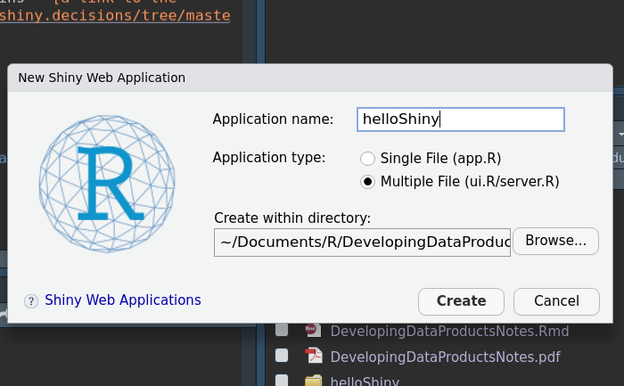

```{r setup, include=FALSE}
knitr::opts_chunk$set(echo = TRUE)
```

# Intro  


## Github Link for Lectures  
**[Developing Data Products' lectures on GitHub](https://github.com/DataScienceSpecialization/Developing_Data_Products)**  

## Course Book  
**[The book for this course is available on leanpub](https://leanpub.com/ddp)** 

## Instructor's Note  
"*This course is about building tools for improving the data analysis process, making data driven decisions, or for other infrastructure that supports other data products...*  
*To preview some of the topics we'll be covering. With the R Markdown package you can create websites, PDFs, presentations, and even e-books from a single file in R in a way that you're very comfortable and familiar with. We'll teach the latest features of the Shiny package which you can use to create interactive web applications in R. We'll talk about interactive graphics using Plotly and Leaflet which allows you to create beautiful maps that you can share online. We'll do similar things with the package GoogleViz which allows you to create maps and interactive graphics and tables. We've also added how to use swirl and swirlify to design courses in R so that you can share your knowledge...*  
  
*- Brian Caffo and the Data Science Track Team*"


# Shiny, GoogleVis, and Plotly  
## Shiny Part 1  


### Shiny Overview 


### Shiny Overview (1.1)  
#### What is Shiny?  
* Shiny is a web development framework in R, meaning one only needs to know R to use it.  
  + Helps one get around a possible lack of resources or knowledge in JavaScipt, HTML, etc.  

* Shiny needs a server to run on  
  + One can use their own, RStudio's limited free hosting service, or something like Amazon AWS. RStudio also has a paid version of their service.  
* Shiny application vs. Shiny server  
  + Apps a ran locally and use RStudio's service for hosting the app on their servers, on a platform called shinyapps.io  
    - the free version only allows one to run 5 apps for a certain amount of time per month  
    - RStudio will send one a message if the limit is reached  
    - Should one hit the 25-hour per month limit they can send an email to *shinyapps-support@rstudio.com* to request an increase in their limit so one can continue working on thier project (for this course)  
  + A Shiny server is required such that one can host a shiny app for the world  
    - It requires understanding a little linux server administration and won't be covered in this course.  

* Although everything is done in R it is helpful to have some knowledge of HTML to know what the commands in R are actually doing.  
* Shiny uses `Bootstrap` (no relation to the statistical method) style, which suffices for aesthetics, rendering, and resizing to fit different screens.    

#### HTML, CSS, and Javascript Tutorials  
* **[Mozilla Developer Network Tutorials](https://developer.mozilla.org/en-US/docs/Web/Tutorials)**  
* **[HTML & CSS from Khan Academy](https://www.khanacademy.org/computing/computer-programming/html-css)**  
* **[Tutorials from Free Code Camp](https://www.freecodecamp.com/)**

#### A Shiny Project  
* There is **[a tutorial for shiny on RStudio](https://shiny.rstudio.com/tutorial/)**, however these notes will sort of walk through that tutorial anyway.  
* A computer interfaces with the app to generate new plots/results based on the users' input on the app.  
* A shiny project consists of a directory with at least two files:  
  + `ui.R` (for user interface) controls how your app looks.  
  + `server.R` that controls what your app does, held on the server.  
  + NOTE: The app doesn't actually need these two files but rather the functions the contain, as such it's also an option to just have a `app.R` file.  
* **[RStudio has some examples of shiny apps too](https://shiny.rstudio.com/gallery/#user-showcase)**  

* I also found someone **[made a game using Shiny](https://towardsdatascience.com/is-r-shiny-versatile-enough-to-build-a-video-game-5c93232ef4e2)**. The game's app also contains **[a link to the GitHub repo.](https://github.com/pedrocoutinhosilva/shiny.decisions/tree/master/src/app)**  


### Shiny Code Demos (1.2)  
A demo is located in `./helloShiny`  

#### Set-Up  

  
  
  
  
  

#### ui.R  
* requires the function `shinyUI`  
  + `fluidPage(` by default has a main panel, `mainPanel(` and a sidebar panel, `sidebarLayout(sidebarPanel(`  

#### server.R  
* requires the function `shinyServer`  
  + Any logical computations are done here


### Shiny HTML Tags (1.3)  
* Shiny provides several wrapper functions for using standard HTML tags in your `ui.R`, including:  
  + `h1()` through `h6()` for headlines  
  + `p()` for paragraphs  
  + `br()` for line-breaks  
  + `a()` for inserting hyperlinks  
  + `div()` denotes a section styled with CSS  
  + `span()` to color a part of the text  
  + See the help page, `?builder` for more details.  
  + A guide of HTML tags **[can be found on this site](https://www.w3schools.com/tags/)**  
  
* Some of these tags are tested in `./helloShiny/`  

### Shiny Apps with I/O (1.4)  
* In this first demo we'll be looking at a slider input, which will just show the value to the user. This demo is found in `./helloSlider/`  


### Shiny Apps with Plots (1.5)
* Allowing users to manipulate data nd see the reults of their manipulations as a plot can be very useful  
* Shiny provides the `plotOutput()` function for `ui.R`  
* ...and the `renderPlot()` function for `sever.R`  
* The demo of this is in `./helloPlot/`  
* Also contains: 
  + in/de-crementing arrows for a textbox  
  + checkboxes for a logical if labels are present  
  


**Reminder to Commit (01), Delete this line** ***AFTER*** **Committing**  

## Shiny Part 2  

### Shiny (2.1)  


### Shiny (2.2)  


### Shiny (2.3)  


### Shiny (2.4)  


### Shiny (2.5)  


### Shiny (2.6)  


**Reminder to Commit (02), Delete this line** ***AFTER*** **Committing**  

## Shiny Gadgets  

### Shiny Gadgets (1.1)  


### Shiny Gadgets (1.2)  


### Shiny Gadgets (1.3)  


**Reminder to Commit (03), Delete this line** ***AFTER*** **Committing**  

## GoogleVis  
### GoogleVis (1.1)  


### GoogleVis(1.2)  


**Reminder to Commit (04), Delete this line** ***AFTER*** **Committing**  

## Plotly  
### Plotly (1.1)  


### Plotly (1.2)  


### Plotly (1.3)  


### Plotly (1.4)  


### Plotly (1.5)  


### Plotly (1.6)  


### Plotly (1.7)  


### Plotly (1.8)  


**Reminder to Commit (05), Delete this line** ***AFTER*** **Committing**  

## Quiz 1  
1. 


2. 


3. 


4. 


5. 


**Reminder to Commit (Q1), Delete this line** ***AFTER*** **Committing**  


# R Markdown and Leaflet  
## R Markdown  


### R Markdown (1.1)  


### R Markdown (1.2)  


### R Markdown (1.3)  


### R Markdown (1.4)  


### R Markdown (1.5)  


### R Markdown (1.6)  


### Sharing R Markdown Documents  


**Reminder to Commit (06), Delete this line** ***AFTER*** **Committing**  

## Leaflet  


### Leaflet (1.1)  


### Leaflet (1.2)  


### Leaflet (1.3)  


### Leaflet (1.4)  


### Leaflet (1.5)  


### Leaflet (1.6)  


**Reminder to Commit (07), Delete this line** ***AFTER*** **Committing**  

## Quiz 2  
1. 


2. 


3. 


4. 


5. 


6. 


**Reminder to Commit (Q2), Delete this line** ***AFTER*** **Committing**  


## Course Project 1  


**Reminder to Commit (P1), Delete this line** ***AFTER*** **Committing**  

# Building R Packages  

## R Packages  

### R Packages Overview  


### R Packages (1.1)  


### R Packages (1.2)  


### Building R Packages Demo  


**Reminder to Commit (08), Delete this line** ***AFTER*** **Committing**  

## R Classes and Methods  
### R Classes and Methods (1.1)  


### R Classes and Methods (1.2)  


**Reminder to Commit (09), Delete this line** ***AFTER*** **Committing**  

## Quiz 3  
1. 


2. 


3. 


4. 


**Reminder to Commit (Q3), Delete this line** ***AFTER*** **Committing**  


## Course Project 2  


**Reminder to Commit (P2), Delete this line** ***AFTER*** **Committing**  


# Swirl  
## Swirl  
### Swirl (1.1)  


### Swirl (1.2)  


### Swirl (1.3)  


**Reminder to Commit (10), Delete this line** ***AFTER*** **Committing**  

## Course Project 3  


**Reminder to Commit (P3), Delete this line** ***BEFORE*** **Committing**  


